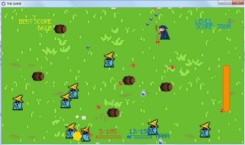
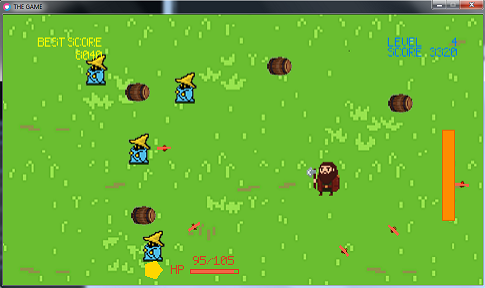
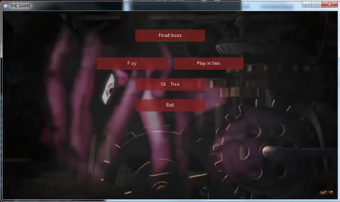
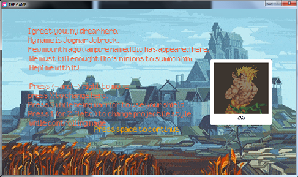
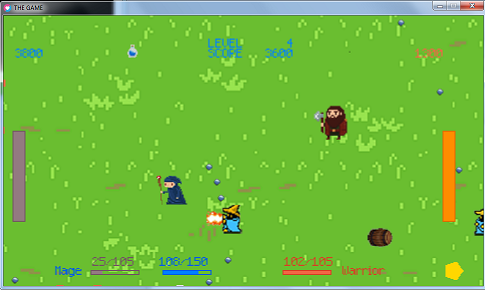
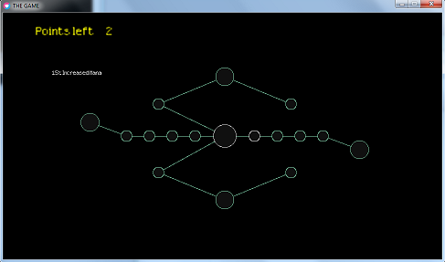

## What's going on?
In this repo you can find an object of my pride: **2-D arcade game written on lua LÖVE**.  
The main goal of this project was to implement a game based on Object-oriented programming programming paradigm 

Please note that **i have no commercial use of it**. This game was made just because i had to make fully-OOP project as course work and, at the same time, was extremely excited by idea of game development.
The game mechanics was mainly inspired by this [guide](https://adnzzzzz.itch.io/bytepath-tutorial "seems that author has deleted it :|"), nevertheless my interpretation have significant differences.

Main features of the game:  
* **three characters** are playable: mage (long-range), warrior or JoJo (both short-range) 
* fight two types of **enemies** 
* the **longer** you play the **harder** the game gets 
* **HP and mana bottles** sometimes drop from enemies, so you can collect them
* **two game modes** are available: singleplayer and local multiplayer
* increase the hero's characteristics using the **skill tree** (amount to HP/Mana, special ability duration)
* Dio from JoJo is the **final Boss** - he has his own unique mechanic
  




## Table of Contents

- [About](#about)
  - [What i took from others](#what-i-took-from-others)
  - [What i did by myself](#what-i-did-by-myself)
- [How to launch](#how-to-launch)
- [How does it work](#how-does-it-work)
  - [Classes](#classes)
  - [Graphic design and music](#graphic-design-and-music)
  - [Playable heroes](#playable-heroes)
  - [Game modes](#game-modes)
  - [Storage and Skill Tree](#storage-and-skill-tree)

# About

I developed it while i was on the middle of second year of my bachelor's degree. This project was enormous for me at this time: it took about 6 week to build it from scratch. Of course, it was based on another's person [guide](https://adnzzzzz.itch.io/bytepath-tutorial "seems that author has deleted it :|") and banch of open source libraries for things like basic physics (more on this below).  

## What i took from others

Whole material in 'libraries, 'music' and 'images' folders were taking from the internet.  
I didn't invent anything new in terms of game design. I implemented the architecture of the game described by the cycle of updating parameters and drawing objects in accordance with them.
The **concepts and most of the code** in classes like *Director* (complicates the game over time), *Stage*, *Area* and *SkillTree* were taken from the quide. They are responsible for the mechanism of the game itself closely related to the capabilities and pros of *lua LÖVE*.

## What i did by myself

Nevertheless, content of the game was mainly written by me: these are mainly the **mechanics of the heroes** themselves, **features, references and different game modes**.  
Things created by me :  
- heroes special abilities
- local multiplayer mode
- all graphic (except pictures downloaded)
- menu 
- final game boss 
- several JoJo references (KONO DIO DA)
- Nyan Cat skin mode (with music)

# How to launch
To run this project you must download free,open-source framework [LÖVE 0.10.2 [Super Toast]](https://github.com/love2d/love/releases/tag/0.10.2).  
Feel free to download it from [official site](https://love2d.org/) of the project. Please pay attention to a version number of framework as the game wouldn't run with LÖVE latest versions. **You must download 0.10.2 [Super Toast] version of framework.**

You can launch the game from the command line by typing:
**"\path to LÖVE comiler" "\path to game"** like that:
```
"C:\Program Files\LOVE\love.exe" "C:\games\mygame" 
```

# How does it work

Most of magic happening insende of cycle in *main.lua*

```
function love.load()

end

function love.update(dt)

end

function love.draw()

end
```

The function *love.load()* is executed once - library import and basic parameters like game window size are set.  
And after that, other two functions *love.update(dt)* *love.draw()* are cyclically called to update and draw objects. Each game class, which interacts with player, has these two functions.  
The game process is presented into few screens: menu, skill tree, arcade game etc. Into the code it echoes with *room-class architecture* and *Area*.  
Area is situated into the room. think about this couple as followes: In the **room** objects (enemies, projectiles, player's hero) are *drawn*, and in the **area**, their parameters are *updated*.  

## Classes

Whole game is dased on interaction between couple of classes (they are located in files with the same name, inside the *objects* folder):
1. Environment:
   * Area (functionality is described above) 
   * Rooms: Sage and MultiStage (for modes for one and two players, respectively); Menu, SkillTree, Dialog Stage and DownStage
   * Diarector: responsible for the enemies spawn 
2. In-game objects:  
   *  Player (and WarPlayer for multiplayer mode) class for playable hero. No matter if it's warrior or mage. Everything implemented in single class.
   *  Enemies: Rock, Shooter, Projectile and Dio
   *  Consumable object: Mana. Sometimes spawns after enemy death. May be collected by player
3. Graphisc:
   * Background - image in a room's background 
   * Effects: ShotEffect, ProjectileDeathEffect
   * InfoText: as i didn't find any proper library to display decals, i did it myself (through the guide probably)

## Graphic design and music 

Have you ever heard about *Jojo's bizzare adentures*? i'm a big fan, so i have screenchot of thid season opening as a menu background.



Main villain of third season is a game boss, I used sounds that he make to make game more authentic. Moreover, the game features stylized images from anime. 



Music:
* 8-bit cover on *Chop Suey* by *System of a down* in regular or multiplayer game more 
* 8-bit cover on jojo's third season opening in menu 
* Dio theme playing during final battle
* Nyan cat music playing while player being a cat

## Playable heroes 

There are three playable heroes-  mage (long-range), warrior or JoJo (short-range both):

- warrior may use *special ability:* a shield to become invulnerable for a short period of time.
- mage has several attack modes (double and triple shots, different angles of attack). 
- Jojo - available after final boss fight - may stop time for a while (special ability).

During the game with a small chance, a bottle can drop after enemy's death. When interacting with it, the player will gain health or mana depending of hero he currently playing. Mage will recover his mana, while warrior and Jojo will get their health back.

The scale of health and mana (only in the game as a mage) is located at the bottom of the screen.

## Game modes 

You can play alone or with a friend within the local-multiplayer. In the latter case, your indicators of gained points, health and mana are taken out into corners of the screen.



## Storage and Skill Tree

As the game progresses, you can kill enemies and get *scores* from it. Scores counter is located at the top-right corner of the game screen.
You will receive from 30 to 100 scores for enemy kill, and you will also got scores for just being alive (30 scores per second). When you recruit more than five thousand, you get a new talent point, which can be spent on improving the hero's characteristics.  
This all stored in JSON memory file and loading while game is starting, so you won't lose your progress.

Available heroes upgrades:
* mana increase on 5% or 15% 
* HP increase on 5 or 15% *
* prolongation of special ability duration for 0.5 and 1 second




---

I really have no idea why anybody got so far while reading this readme, but if you did so - *thank for your time*.


